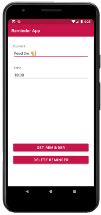
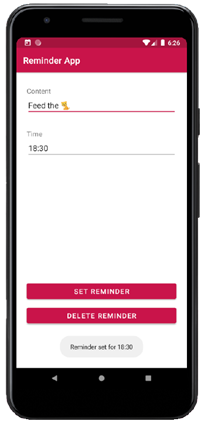

# Android App Library: Background Notification

## About
Welcome to our Android application. The app is part of the Open Sorce [Android App Library](https://github.com/LukPle/android-app-library.git) 
and adopts all licensing and community guidelines from this project. Please use the link in order to check out the corresponding repository.

The android-notification-background app contains two input fields. One of them is an **EditText** field for text input and the other one a **TimePickerDialog**.
An **AlarmManager** takes the time and creates a **Notification** with the content from the user later at the exact time. 
This process demands a **NotificationChannel** and a **NotificationManager**. The application serves as an example of these features.

## Features
The setting of this program is a reminder app. The user can create a new reminder by filling values in the EditText field and the TimePicker.
Clicking the Button sets the reminder. This means that the Notification will be shown at the time chosen by the user.
It stays in the Notification Center of the phone afterwards.  

## Usage
You can clone the repository into Android Studio by clicking "Get from VCS" in the Welcome Screen or navigating to "File - New - Project from Version Control" inside 
the IDE. When doing so use the URL provided by GitHub. You can run the app on your mobile device or an emulator. Feel free to modify the code or utilize this sample 
for your own project.
